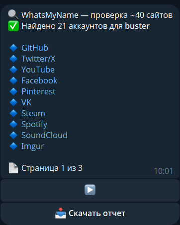
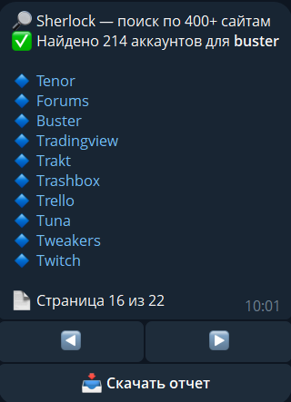
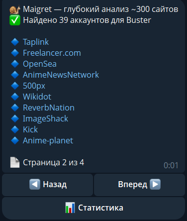

# Telegram OSINT Nickname Search & Data Mining Bot 🔎🤖

[](https://www.python.org/)
[](LICENSE)
[](https://core.telegram.org/bots)
[](https://docs.python.org/3/library/asyncio.html)

---

## English Version

### Bot OSINT Search Output Previews

| WhatsMyName Module | Sherlock Module | Maigret Module |
| :---: | :---: | :---: |
|  |  |  |

---

### Description
High-performance Telegram bot for automated searching and aggregation of public information by usernames and accounts across online platforms.

### Key Architectural Features
- ⚡ **Asynchronous Stack:** Built on `asyncio` / `aiohttp` for high-throughput network processing.
- 🗄️ **Data Persistence:** Integration with PostgreSQL 15 and Redis 7 caching.
- 🔒 **Security:** Configuration tokens and credentials isolated via `.env` variables.

### Tech Stack
* **Language:** Python 3.10+
* **Networking & API:** `telebot` / `aiohttp` / `requests`
* **Parsing:** `BeautifulSoup4`, `lxml`
* **Infrastructure:** Docker Compose, PostgreSQL, Redis

### Repository Structure
```text
├── bazanick6_3v1.py    # Main asynchronous Telegram bot logic
├── assets/             # OSINT search module preview screenshots
│   ├── search_wmn.png
│   ├── search_sherlock.png
│   └── search_maigret.png
├── .gitignore          # Git ignore rules
├── LICENSE             # MIT License
└── README.md           # Documentation
```

### Quick Start
1. **Clone repository:**
   ```bash
   git clone https://github.com/Bargaisl/tg-nick-finder.git
   cd tg-nick-finder
   ```
2. **Set environment variables:**
   Create a `.env` file based on the template:
   ```env
   BOT_TOKEN=your_telegram_bot_token_here
   ```
3. **Run application:**
   ```bash
   python bazanick6_3v1.py
   ```

### ⚠️ Disclaimer, Precautions & Legal Notice
**THIS TOOL IS INTENDED STRICTLY FOR EDUCATIONAL, AUDITING, AND ETHICAL OSINT RESEARCH PURPOSES.**  
The developers explicitly disclaim any liability for improper, illegal, or unethical use of this bot. Users are solely responsible for ensuring compliance with local laws, data privacy regulations (e.g., GDPR), and terms of service of target platforms. The author does not encourage or support stalking, harassment, or unauthorized data scraping.

### License
Licensed under the [MIT License](LICENSE).

---

## Русская версия (Russian Version)

### Примеры вывода OSINT-поиска бота

| Модуль WhatsMyName | Модуль Sherlock | Модуль Maigret |
| :---: | :---: | :---: |
|  |  |  |

---

### Описание
Высокопроизводительный Telegram-бот для автоматизированного поиска и агрегации публичной информации по никнеймам и учетным записям в сети.

### Ключевые архитектурные особенности
- ⚡ **Асинхронность:** Построена на `asyncio` / `aiohttp` для высоконагруженной работы с сетью.
- 🗄️ **Хранение данных:** Интеграция с PostgreSQL 15 и кэшированием результатов в Redis 7.
- 🔒 **Изоляция конфигурации:** Все секреты и токены вынесены в переменные окружения `.env`.

### Стек технологий
* **Язык:** Python 3.10+
* **Сеть & API:** `telebot` / `aiohttp` / `requests`
* **Парсинг:** `BeautifulSoup4`, `lxml`
* **Инфраструктура:** Docker Compose, PostgreSQL, Redis

### Структура репозитория
```text
├── bazanick6_3v1.py    # Основной модуль Telegram-бота
├── assets/             # Скриншоты работы поисковых модулей OSINT
│   ├── search_wmn.png
│   ├── search_sherlock.png
│   └── search_maigret.png
├── .gitignore          # Исключения Git
├── LICENSE             # Лицензия MIT
└── README.md           # Техническая документация
```

### Быстрый запуск
1. **Клонируйте репозиторий:**
   ```bash
   git clone https://github.com/Bargaisl/tg-nick-finder.git
   cd tg-nick-finder
   ```
2. **Настройте переменные окружения:**
   Создайте `.env` файл на базе примера и укажите ваш токен:
   ```env
   BOT_TOKEN=your_telegram_bot_token_here
   ```
3. **Запустите приложение:**
   ```bash
   python bazanick6_3v1.py
   ```

### ⚠️ Предупреждение, правовая информация и отказ от ответственности
**ДАННЫЙ ИНСТРУМЕНТ ПРЕДНАЗНАЧЕН ИСКЛЮЧИТЕЛЬНО ДЛЯ УЧЕБНЫХ, АУДИТОРСКИХ И ЭТИЧНЫХ ЦЕЛЕЙ OSINT-ИССЛЕДОВАНИЙ.**  
Разработчики явно отказываются от любой ответственности за ненадлежащее, незаконное или неэтичное использование данного бота. Пользователи несут единоличную ответственность за соблюдение местного законодательства, законов о защите персональных данных и правил использования целевых платформ. Автор не одобряет преследование, домогательства или несанкционированный сбор данных.

### Лицензия
Распространяется под лицензией [MIT License](LICENSE).
